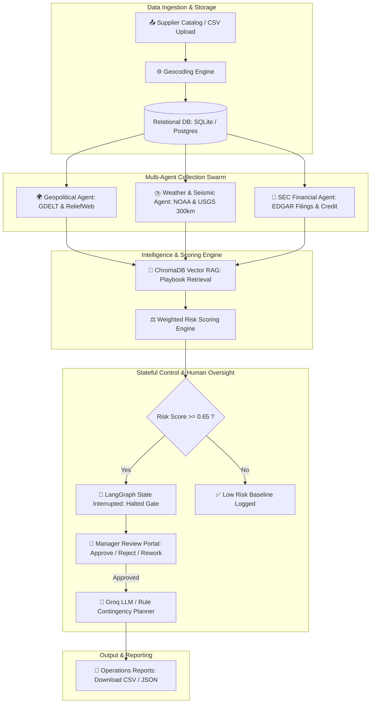

# 🛡️ AI Supply Chain Risk Monitor for SMB Importers

> **Autonomous Stateful Multi-Agent System for Supply Chain Disruption Monitoring, Vector Intelligence (RAG Grounding), and Human-in-the-Loop Resiliency Planning**

---

## 📌 Problem Statement & Core Purpose

Small and Medium-Sized Businesses (SMBs) importing goods internationally often face severe operational vulnerabilities. Unlike giant conglomerates with dedicated intelligence divisions, SMBs lack real-time visibility into multi-tiered supply chain hazards:

- 🌍 **Geopolitical Disturbances**: Unannounced port strikes, labor blockades, export tariffs, and regional conflicts.
- ⛈️ **Severe Weather & Seismic Hazards**: Hurricanes, floods, and earthquakes within manufacturing zones.
- 🏦 **Vendor Insolvency**: Unexpected supplier credit downgrades, restructurings, or liquidity failures.

**AI Supply Chain Risk Monitor** is an enterprise-grade AI solution designed to bridge this gap. It acts as an autonomous digital risk management department that continuously monitors global hazard feeds, geocodes vendor supply networks, calculates transparent weighted risk scores, grounds mitigation strategies in vector playbooks, and enforces **Human-in-the-Loop approval gates** before high-impact contingency actions are finalized.

---

## 🎯 Key Application Capabilities

| Feature | Description |
| :--- | :--- |
| **🌐 Interactive 3D PyDeck Map** | Visualizes global vendor locations with color-coded risk pins (*Critical*, *High*, *Medium*, *Low*) and interactive tooltips. |
| **⚡ Parallel Multi-Agent Swarm** | Runs concurrent agent nodes evaluating live GDELT, ReliefWeb, NOAA, USGS (within 300km radius), and SEC EDGAR data. |
| **🧠 Vector Intelligence (RAG)** | Queries embedded vector stores in **ChromaDB** to match real-time threats with historical mitigation playbooks. |
| **⚖️ Transparent Weighted Scoring** | Merges multi-source risk signals using transparent, configurable rules (`risk_scoring_rules.yaml`). |
| **🛑 LangGraph Human Review Gate** | Uses SQLite checkpointers to halt workflow execution when risk scores cross critical thresholds (`>= 0.65`), requiring manager sign-off. |
| **🤖 AI & Rule-Based Contingency Planner** | Drafts grounded backup strategies (volume shifts, lead time deltas, alternate suppliers) using Groq LLM with local rule fallbacks. |
| **💾 Operations Report Exporter** | Generates downloadable risk matrices and approved resiliency actions in structured **CSV** and **JSON** formats. |

---

## 🏗️ System Architecture & Workflow

The diagram below illustrates how data flows from supplier catalog ingestion through the multi-agent collection swarm, RAG retrieval, risk scoring engine, LangGraph human review gate, and final export:



---

## 🤖 Detailed Breakdown of Agent Nodes

### 1. 🌍 Geopolitical Risk Collector
- **Data Sources**: GDELT Project v2 API & ReliefWeb Humanitarian API.
- **Role**: Scrapes news feeds surrounding supplier locations for strikes, civil unrest, export restrictions, and port closures.
- **Guardrails**: Filters URLs against domain allowlists in `guardrails/source_allowlist.yaml`.

### 2. ⛈️ Weather & USGS Seismic Monitor
- **Data Sources**: NOAA Severe Weather Alerts API & USGS Earthquake Hazards API.
- **Role**: Detects active severe weather alerts and identifies earthquakes occurring within a **300km radius** of supplier coordinates.
- **Scoring**: Applies proximity and magnitude decay formulas configured in `risk_scoring_rules.yaml`.

### 3. 🏦 SEC Financial & Credit Health Agent
- **Data Sources**: SEC EDGAR 10-Q/10-K filings and credit rating alerts.
- **Role**: Flags liquidity shortages, restructuring notices, or credit downgrades for corporate vendor entities.

### 4. 🧠 Vector Intelligence (ChromaDB RAG)
- **Role**: Searches local vector databases seeded with domain supply chain playbooks using HuggingFace BGE embeddings (`bge-small-en-v1.5`).
- **Purpose**: Grounds AI recommendations in verified organizational procedures rather than generic LLM hallucinations.

### 5. 🛑 LangGraph Human Interrupt Gate
- **Role**: LangGraph stateful checkpointer that halts execution whenever a supplier's composite risk score reaches or exceeds **0.65 (High/Critical)**.
- **Purpose**: Prevents autonomous execution of high-risk operational shifts without explicit manager review and approval.

### 6. 🤖 Contingency Planner Agent
- **Role**: Drafts structured mitigation plans detailing proposed volume shifts (e.g., shifting 40% cargo to air freight) and alternate backup vendors.
- **Fallback Guarantee**: Uses Groq LLM (`groq/compound`) for high-fidelity drafting, with instant local rule-based generation if API limits or offline modes occur.

---

## 📱 Module-by-Module Application Guide

### 1. 🏠 Executive Landing Dashboard (`app.py`)
- Live system status pill badge (`🟢 SYSTEM ONLINE • 5 AGENT NODES ACTIVE`).
- Dynamic KPI stat cards: *Monitored Vendors*, *Active Disruption Signals*, *Pending Reviews*, and *Resiliency Index %*.
- Interactive 3D PyDeck global map with risk-colored pins and hover cards.
- Interactive multi-agent pipeline explorer tabs.

### 2. 📤 Supplier Onboarding (`1_supplier_upload.py`)
- Import supplier catalogs via CSV upload or manual entry forms.
- Automatic OpenStreetMap Nominatim geocoding to resolve latitude/longitude coordinates.
- Configure primary shipping ports, product categories, lead times, and approved backup vendors.

### 3. 📈 Executive Risk Dashboard (`2_risk_dashboard.py`)
- Select any vendor to inspect detailed component dependency risk metrics.
- Click **Trigger Risk Monitoring Workflow** to execute the multi-agent graph in real time.
- View composite risk score meters, severity breakdowns, and contributing threat evidence.

### 4. 🔔 Disruption Feed & Intelligence (`3_risk_events.py`)
- Inspect live GDELT geopolitical news, NOAA weather advisories, and USGS earthquake events.
- **Custom Event Injector**: Inject test disruption events to validate scoring triggers and workflow halts.

### 5. 🤝 Human Approval Gate (`4_contingency_plans.py`)
- Review stateful LangGraph-halted contingency recommendations.
- Evaluate draft volume shifts, lead time deltas, assumptions, and playbook evidence links.
- Manager Action Buttons: **Approve** (commits plan), **Reject** (cancels), or **Request Rework** (re-runs graph with feedback).

### 6. 💾 Operations Reports & Export (`5_reports.py`)
- Generate consolidated risk matrices across all active suppliers.
- Download reports in formatted **CSV** or **JSON** for operations and logistics teams.

---

## ⚙️ Installation & Setup Guide

### 📋 Prerequisites
- **Python 3.10+** (Developed and tested on Python 3.11)

### 💻 Step-by-Step Setup

1. **Clone the repository**:
   ```bash
   git clone https://github.com/Mradul2k04/AI-Supply-Chain-Risk-Monitor-for-SMB-Importers-.git
   cd AI-Supply-Chain-Risk-Monitor-for-SMB-Importers-
   ```

2. **Create and activate a virtual environment**:
   ```powershell
   python -m venv .venv
   # Windows PowerShell
   .venv\Scripts\Activate.ps1
   # Linux/macOS
   source .venv/bin/activate
   ```

3. **Install dependencies**:
   ```powershell
   pip install -r requirements.txt
   ```

4. **Environment Variables Configuration**:
   Copy `.env.example` to `.env`:
   ```powershell
   copy .env.example .env
   ```

   *Core Configuration Keys in `.env`:*
   ```ini
   APP_NAME=AI Supply Chain Risk Monitor
   LLM_PROVIDER=groq
   LLM_MODEL=groq/compound
   GROQ_API_KEY=your_groq_api_key_here
   DATABASE_URL=sqlite:///./supply_chain_risk.db
   ```
   > 💡 *Note: If `GROQ_API_KEY` is omitted or left blank, the application automatically runs in high-fidelity rule-based mode, allowing full evaluation without any paid API keys.*

---

## 🏃 Running the Application

1. **Launch the Streamlit Server**:
   ```powershell
   streamlit run app.py
   ```
2. Open your browser at **`http://localhost:8501`**.

---

## 🧪 Testing Suite

The project includes an automated test suite verifying routing logic, ChromaDB retrievals, scoring rules, guardrails, and boundaries.

Run tests using Pytest:
```powershell
python -m pytest tests/
```

*Test Modules Included:*
- `tests/test_chromadb_retrieval.py`: Tests vector embedding query precision & filtering.
- `tests/test_contingency_plans.py`: Tests contingency drafting & manager approval state transitions.
- `tests/test_graph_routing.py`: Validates LangGraph conditional edges & checkpointer state saves.
- `tests/test_guardrails.py`: Enforces domain allowlists & volume shift boundary constraints.
- `tests/test_risk_scoring.py`: Verifies weighted scoring logic formulas.

---

## 🛡️ Security, Allowlisting & Guardrails

- **Domain Allowlisting**: External intelligence sources are strictly matched against `guardrails/source_allowlist.yaml` to prevent untrusted news injection.
- **Grounding Rules**: Prompts enforce zero-hallucination policies using system rules defined in `guardrails/prompt_rules.py`.
- **Constraint Validators**: Backup supplier selections are strictly restricted to vendors in the supplier's pre-approved alternate list.

---

## 📂 Project Directory Structure

```
├── app.py                      # Executive Landing Dashboard & Control Center
├── pyproject.toml              # Package configuration & dependencies
├── requirements.txt            # Dependency manifest
├── risk_scoring_rules.yaml     # Configurable weighted risk scoring parameters
├── pages/                      # Application Navigation Pages
│   ├── 1_supplier_upload.py    # Supplier CSV Import & Geocoding Portal
│   ├── 2_risk_dashboard.py     # Executive Risk Dashboard & Agent Trigger
│   ├── 3_risk_events.py        # Live Disruption Feed & Custom Event Injector
│   ├── 4_contingency_plans.py   # Human Approval Gate & Review Sign-off
│   └── 5_reports.py            # Reports Generator & File Exporter
├── guardrails/                 # Security & Validator Rules
│   ├── prompt_rules.py         # LLM Grounding System Prompts
│   ├── source_allowlist.yaml   # Domain & API Allowlist Registry
│   └── validators.py           # Guardrail & Constraint Enforcement
├── src/                        # Core Application Source Code
│   ├── agents/                 # Autonomous Agent Implementations (Geo, Weather, SEC, Contingency)
│   ├── config/                 # Settings Singleton & Logger Setup
│   ├── connectors/             # GDELT, NOAA, USGS, SEC API Connectors
│   ├── graph/                  # LangGraph Workflow, Routing & Checkpoints
│   ├── rag/                    # ChromaDB Vector Ingestion & Retrievers
│   ├── schemas/                # Pydantic Schemas (Supplier, RiskEvent, ContingencyPlan)
│   └── services/               # Database ORM, UI Helpers, Session Services
└── tests/                      # Automated Pytest Integration & Unit Tests
```

---

## 📄 License

Distributed under the MIT License. See `LICENSE` for details.
