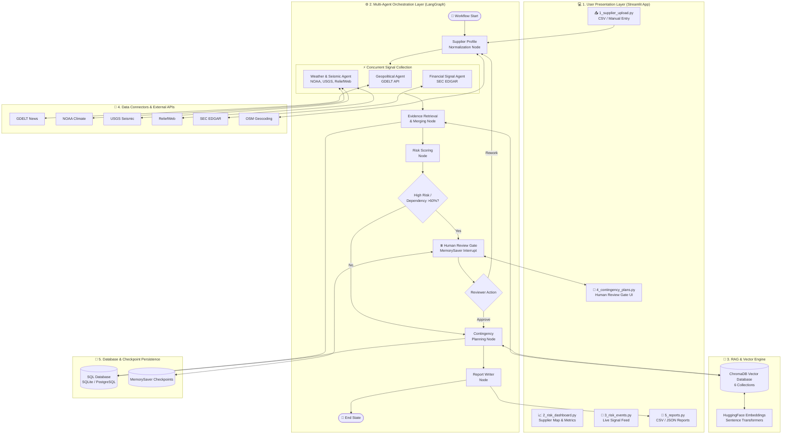

# 🗺️ AI Supply Chain Risk Monitor — System Architecture & Workflow

---

## 🏛️ 1. Interactive System Architecture Diagram (Mermaid GFM)

---

## 🛠️ 2. Architectural Component Breakdown

### Layer 1: User Presentation Layer (Streamlit App)
* [`1_supplier_upload.py`](file:///c:/Users/Acer/OneDrive/Desktop/AI_Supply_Chain_Risk_Monitor/pages/1_supplier_upload.py): Vendor master CSV upload & manual vendor entry.
* [`2_risk_dashboard.py`](file:///c:/Users/Acer/OneDrive/Desktop/AI_Supply_Chain_Risk_Monitor/pages/2_risk_dashboard.py): Interactive supplier map, risk trends, and active threat exposure.
* [`3_risk_events.py`](file:///c:/Users/Acer/OneDrive/Desktop/AI_Supply_Chain_Risk_Monitor/pages/3_risk_events.py): Geopolitical, climate, and seismic live alert review.
* [`4_contingency_plans.py`](file:///c:/Users/Acer/OneDrive/Desktop/AI_Supply_Chain_Risk_Monitor/pages/4_contingency_plans.py): Human-in-the-loop approval gate interface (Approve / Rework / Reject).
* [`5_reports.py`](file:///c:/Users/Acer/OneDrive/Desktop/AI_Supply_Chain_Risk_Monitor/pages/5_reports.py): Export downloadable spreadsheets (CSV / JSON).

---

### Layer 2: Multi-Agent Orchestration Layer (LangGraph)
* **Supplier Profile Normalization Node**: Geocodes vendor coordinates via OpenStreetMap API.
* **Concurrent Signal Collection**: Parallel agent mining (Geopolitical GDELT, Weather/USGS 300km radius, SEC EDGAR).
* **Evidence Retrieval & Merging Node**: Deduplicates events and enriches signals via vector search.
* **Risk Scoring Node**: Multi-factor weighted composite scoring engine (0–100).
* **Human Review Gate**: MemorySaver state interrupt checkpointer for high-risk vendor alerts.
* **Contingency Planning Node**: Recommends volume shifts and lead-time buffer deltas.
* **Report Writer Node**: Synthesizes final executive reports.

---

### Layer 3: RAG & Vector Engine
* **ChromaDB Vector Database**: Indexes 6 specialized collections (`supplier_profiles`, `risk_events`, `regional_risk_profiles`, `financial_evidence`, `contingency_playbooks`, `supplier_performance`).
* **HuggingFace Embeddings**: SentenceTransformers embeddings for semantic playbook matching.

---

### Layer 4: Data Connectors & External APIs
* **GDELT News**, **NOAA Climate**, **USGS Seismic**, **ReliefWeb**, **SEC EDGAR**, **OSM Geocoding**.

---

### Layer 5: Database & Checkpoint Persistence
* **SQL Database**: Persistent SQLAlchemy relational storage for suppliers, events, assessments, and audit logs.
* **MemorySaver Checkpoints**: Serializes LangGraph thread state for human interrupt gates.
